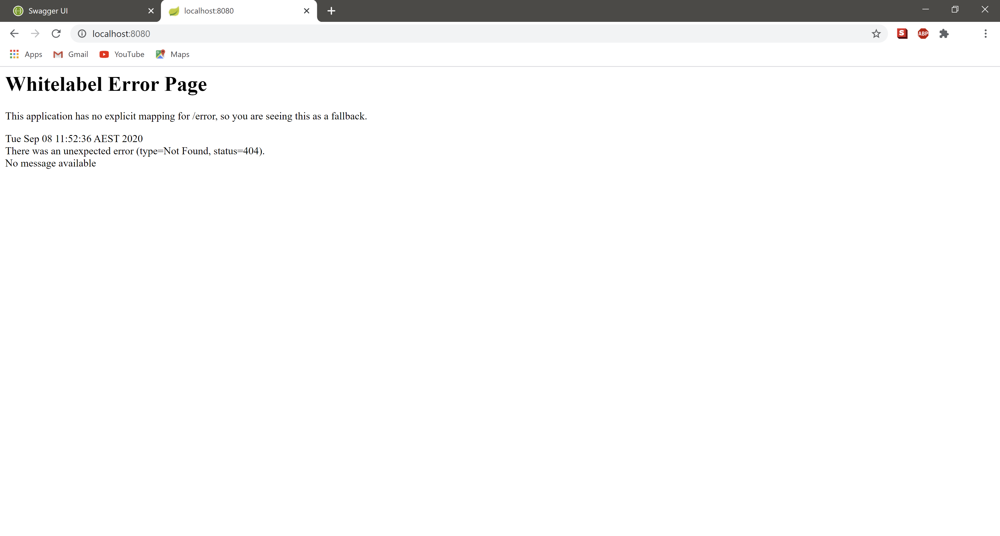
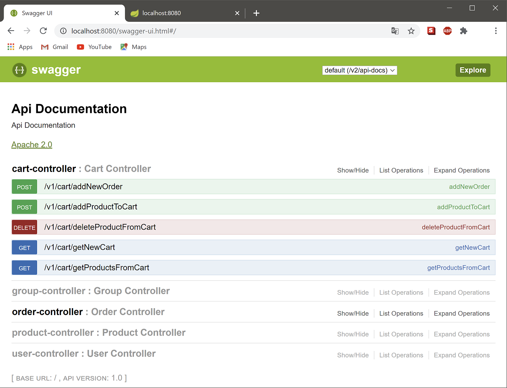
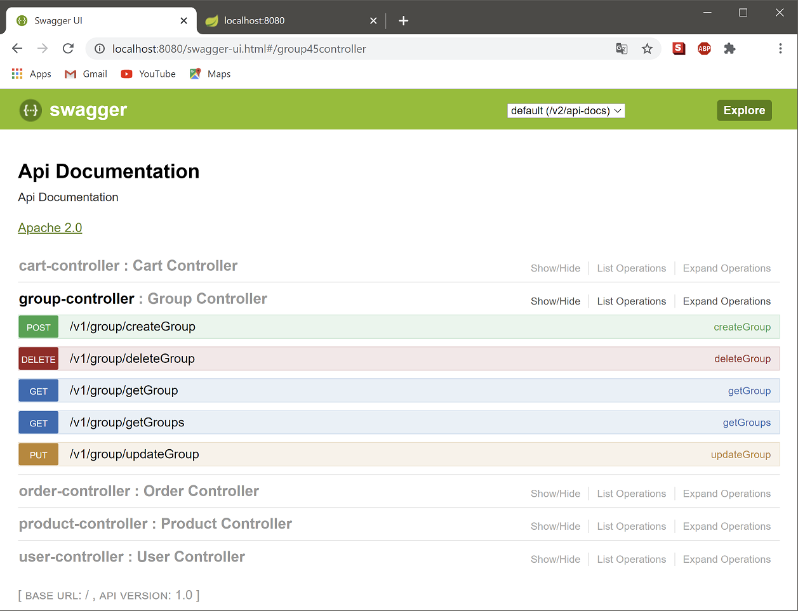
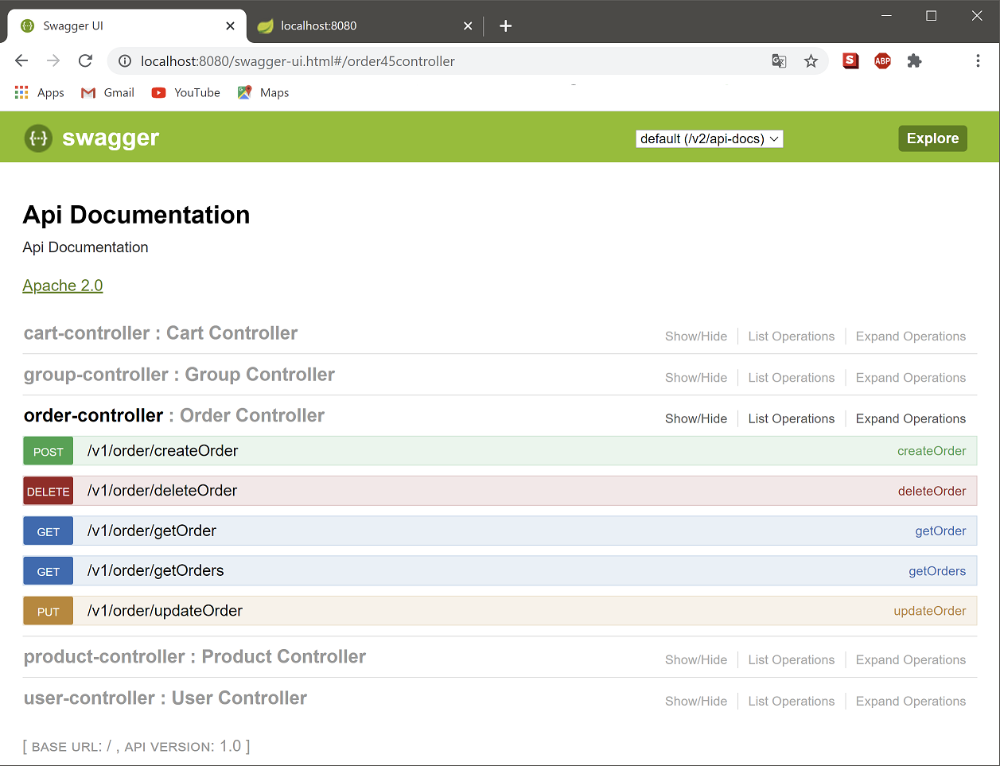
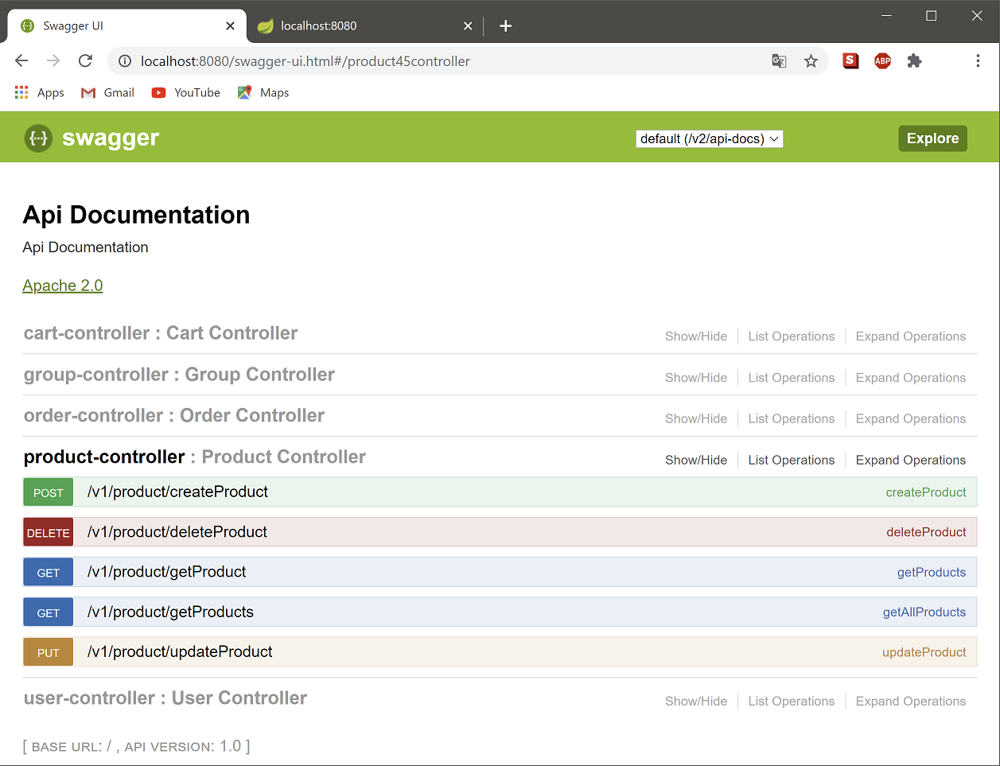
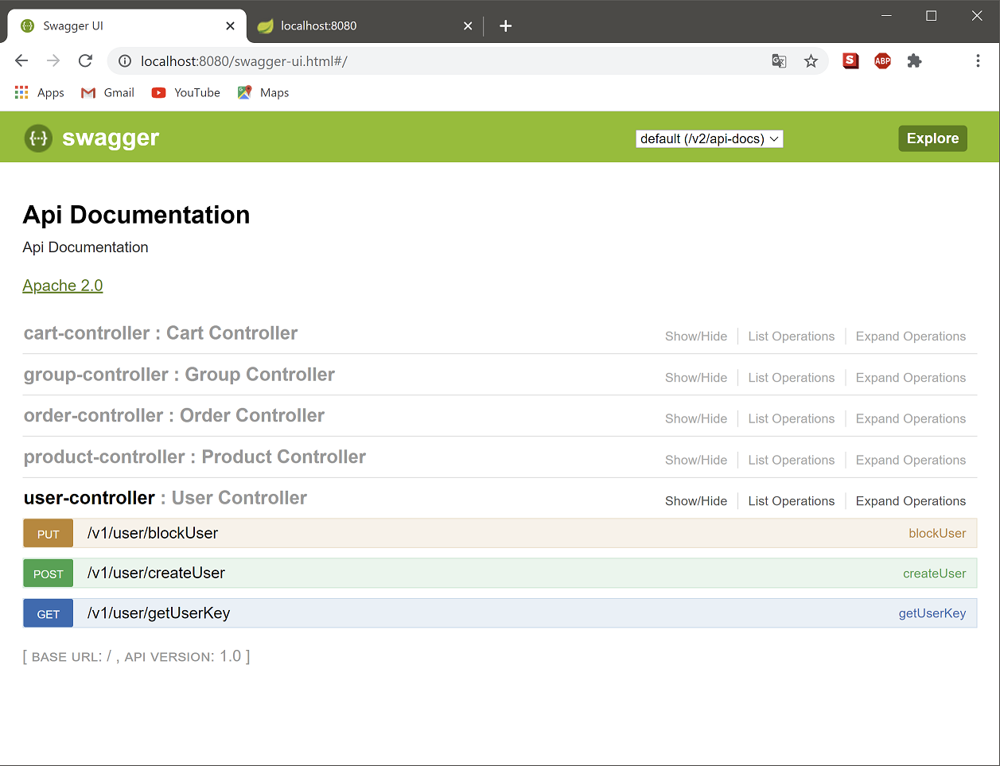

# 1. Description

This project is an implementation of a simple BackEnd logic for an ecommerce store. 
It is implemented in a REST architecture, and it is made of 5 entities (product, group, user, cart, order) 
coupled together with SQL-style relationships and business logic.

# 2. Demo

Project is not publicly available at the moment, and exists as this GitHub repo. However, it can be launched locally via Intellij
or any other Java IDE, and accessed under [local address](http://localhost:8080).

# 3. Requirements

- Java 8
- MySQL 8 server
- Gradle 4.10
- Spring Boot 2.1.1
- Lombok 1.18
- Swagger 2

# 4. Startup

Project can be launched locally by executing EcommerceeApplication class, which starts up the Spring ApplicationContext.

# 5. Endpoints description

Full endpoint documentation is available on a webpage, dynamically generated by the running project under `URL/swagger-ui.html`.

# 6. Application

At this stage, project simulates a simple operation of an ecommerce store, which houses the following:
- User & Cart (decoupled, a Cart can exist without a User, if not logged in)
- Product & Group (decoupled Products can belong to certain product Groups (1 group per product type), 
and Groups can exist without any products attached to them)
- Order (build based on a passed Cart)

Further development of the application can include the following:
- User logging in and out, with User's details being stored in the DB for easier Order completion
- Order class expansion to include user details required to issue an invoice

Other...

# 7. Troubleshooting

TBA